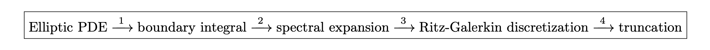

# Summary

PyStokes is a Python library for studying phoretic and hydrodynamic interactions between spherical particles when these interactions can be described by the solutions of, respectively, the Laplace and Stokes equations. The library has been specifically designed for studying these interactions in suspensions of active particles,  which are distinguished by their ability to produce flow, and thus motion, in the absence of external forces or torques. Such particles are endowed with a mechanism to produce hydrodynamic flow in a thin interfacial layer, which may be due to the motion of cilia, as in microogranisms [@brennen1977] or osmotic flows of various kinds in response to spontaneously generated gradients of phoretic fields [@ebbens2010pursuit]. The latter, often called autophoresis,  is a generalisation of well-known phoretic phenomena including, *inter alia*,  electrophoresis (electric field), diffusiophoresis (chemical field) and thermophoresis (temperature field) that occur in response to externally imposed gradients of phoretic fields [@anderson1989colloid]. 


Hydrodynamic and phoretic interactions between active particles in a viscous fluid are central to the understanding of their collective dynamics.  Under experimentally relevant conditions, the motion of the fluid is governed by the Stokes equation and that of the phoretic field, if one is present, by the Laplace equation.  The “activity” appears in these equations as boundary conditions on the particle surfaces that prescribe the slip velocity in the Stokes equation and flux of the phoretic field in the Laplace equation (see \autoref{fig:figS}). 
The slip velocity and the phoretic flux are related by a linear constitutive law that can be derived from a detailed analysis of the boundary layer physics [@anderson1989colloid]. The Stokes and Laplace equations are coupled by this linear constitutive law only at the particle boundaries. The linearity of the governing equations and of the coupling boundary conditions allows for a formally exact solution of the problem of determining the force per unit area on the particle surfaces. This formally exact solution can be approximated to any desired degree of accuracy by a truncated series expansion in a complete basis of functions on the particle boundaries. This, in turn, leads to an efficient and accurate numerical method for computing hydrodynamic and phoretic interactions between active particles.

In addition to the joint computation of phoretic and hydrodynamic interactions, the  PyStokes library can be used to compute the hydrodynamically interacting motion of squirming particles where the slip is specified independently of a phoretic field, or the dynamics of passive suspensions where the slip vanishes and forces and torques are prescribed. The PyStokes library can also compute hydrodynamically correlated  Brownian motion, and thus, allows the study of the interplay between passive, active and Brownian contributions to motion. 

The PyStokes library has been used to model suspensions of microorganisms [@bolitho2020; @singh2016crystallization], 
synthetic autophoretic particles [@singh2016crystallization; @singh2019competing] and 
self-propelling droplets [@thutupalli2018FIPS]. Our software implementation uses a polylgot programming approach that combines the readability of Python with the speed of Cython and retains the advantages of a high-level, dynamically typed, interpreted language without sacrificing performance.

# Methods

Our method relies on the reduction of linear elliptic partial differential equations to systems of linear algebraic equations using following steps:  



The first step is the representation of the solution of an elliptic partial differential equation (PDE) in a three-dimensional volume $V$ as an integral over the 
boundary of the surface $S$ [@fkg1930bandwertaufgaben; @ladyzhenskaya1969; @youngren1975stokes; @zick1982stokes; @pozrikidis1992; @muldowney1995spectral; @cheng2005heritage; @singh2015many]. 
For the Laplace equation, this is the classical theorem of Green [@jackson1962classical]; for the Stokes equation, it is the generalization obtained by 
Lorentz [@fkg1930bandwertaufgaben; @lorentz1896eene; @ladyzhenskaya1969]. The integral representation leads to a linear integral equation that provides a 
functional relation between the field and its flux on $S$. Thus, if the surface flux in the Laplace equation is specified, the surface concentration is determined 
by the solution of the Laplace boundary integral equation. Similarly, if the surface velocity in the Stokes equation is specified, the surface traction is determined 
by the solution of the Stokes boundary integral equation. This transformation of the governing PDEs is the most direct way of relating boundary conditions (surface flux, slip velocities) 
to boundary values (surface concentration, surface traction). It reduces the dimensionality of the problem from a three-dimensional one in $V$ to a two-dimensional one on $S$. 
The second step is the spectral expansion of the field and its flux in terms of global basis functions on $S$. We use the geometry-adapted tensorial spherical harmonics, 
which provide a unified way of expanding both scalar and vector quantities on the surface of a sphere. These functions are both complete and orthogonal and provide representations of 
the three-dimensional rotation group [@hess2015tensors]. Thus, symmetries of the active boundary conditions can be represented in a straightforward and transparent manner. 
The third step is the discretization of the integral equation using the procedure of Ritz and Galerkin [@boyd2001chebyshev; @finlayson1966method], which reduces it to an 
infinite-dimensional self-adjoint linear system in the expansion coefficients. This exploits the orthogonality of the basis functions on the sphere. The matrix elements of 
the linear system can be evaluated analytically in terms of the Green's functions of the respective elliptic equations. The fourth step is the truncation of the 
infinite-dimensional linear system to a finite-dimensional one that can be solved by standard methods of linear algebra adapted for self-adjoint systems [@saad2003iterative]. 
Analytical solution can be obtained by Jacobi iteration, which is equivalent to Smoluchowski's method of reflections. Numerical solutions can be obtained by the conjugate 
gradient method, at a cost quadratic in the number of unknowns. From this solution, we can reconstruct the field and the flux on the boundary, use these to determine the 
fields in the bulk, and from there, compute derived quantities. 

The above steps have been elaborated in several 
papers [@singh2015many; @singh2016crystallization; @singh2017fluctuation; @singh2018generalized; @singh2019competing] and we do not repeat them in detail here. Briefly, the expansion coefficients of the slip can be either specified or obtained as a solution of Laplace equation. Once the coefficients are determined, the following equation are solved numerically to obtain velocity and angular velocity of the $i$-th particle
\begin{align*}
{\mathbf{V}}_{i}&=
\boldsymbol{\mu}_{ij}^{TT}\cdot{\mathbf{F}_{j}^{P}}+ 
\boldsymbol{\mu}_{ij}^{TR}\cdot{\mathbf{T}_{j}^{P}} + 
\sum_{l\sigma=1s}^{\infty}\boldsymbol{\pi}_{ij}^{(T,\,l\sigma)}\cdot{\mathbf{V}_{j}^{(l\sigma)}},\qquad \boldsymbol{\mu}_{ij}^{\alpha\beta}\quad:\text{ mobility matrices},
\\
{\mathbf{\Omega}}_{i}&=\underbrace{
\boldsymbol{\mu}_{ij}^{RT}\cdot\mathbf{F}_{j}^{P}+
\boldsymbol{\mu}_{ij}^{RR}\cdot\mathbf{T}_{j}^{P}}_{\text{Passive}}+
\sum_{l\sigma=1s}^{\infty}\underbrace{
\boldsymbol{\pi}_{ij}^{(R,\,l\sigma)}\cdot\mathbf{{\mathbf{V}}}_{j}^{(l\sigma)}}_{\text{Active}},\qquad \boldsymbol{\pi}_{ij}^{(\alpha, l\sigma)}:\text{ propulsion tensors}.
\end{align*}
In the above, $\alpha,\beta=(T,R)$, repeated particle indices $j$ is summed, and
\begin{equation*}
\mathbf{F}_{i}^{P}:\text{body force},\quad \mathbf{T}_{i}^{P}:\text{body torque},\quad \mathbf{V}_{i}^{(l\sigma)}: l\sigma\text{-th expansion coefficients of active slip}.
\end{equation*}
Thus, hydrodynamic interactions between particles with no-slip boundary conditions can be computed entirely in terms of mobility matrices, as implemented in existing numerical libraries [@hinsen1995; @libstokes], to study suspensions of passive particles. The active contributions due to the slip boundary condition is given in terms of propulsion tensors [@singh2015many]. To the best of our knowledge, PyStokes is the only numerical implementation of propulsion matrices to model suspensions of active particles.      


To summarize, the principal features that set our method apart are (a) the restriction of independent fluid and phoretic degrees of freedom to the particle boundaries 
(b) the freedom from grids, both in the bulk of the fluid and on the particle boundaries and 
(c) the ability to handle, within the same numerical framework, a wide variety of geometries and boundary conditions, 
including unbounded volumes, volumes bounded by plane walls or interfaces, periodic volumes and, indeed, 
any geometry-boundary condition combination for which the Green's functions of the governing equations are simply evaluated.


The PyStokes library can be instantiated in the following way to 

* obtain phoretic field of active particles at an arbitrary set of grid points
```python
phoreticField = pystokes.phoreticUnbounded.Field(radius=1, particles=1, 
                phoreticConstant=1, gridpoints=4096)
```

* compute fluid flow of active particles at an arbitrary set of grid points 
```python
Flow = pystokes.unbounded.Flow(radius=1, particles=1, viscosity=1, 
        gridpoints=4096) 
```

* phoretic field at surface of active particles
```python
phoresis = pystokes.phoreticUnbounded.Phoresis(radius=1, particles=1024, 
            phoreticConstant=1)
```

* rigid body motion of hydrodynamically interacting particles
```python
Rbm = pystokes.unbounded.Rbm(radius=1, particles=1024, viscosity=1) 
```


The above instantiation can then be used to compute `Flow` and `Rbm` due to body forces, body torques, and each irreducible mode of the surface slip in various geometries of Stokes flow, by replacing `unbounded` with `wallBounded`, `interface`, `periodic`, etc. `pystokes.forceFields` contains implementation of force fields commonly used in colloidal systems for completeness. The arXiv preprint [@singh2019Hydrodynamic] of this article contains more detailed documentation and examples.
  

# Acknowledgements

We thank A Banerjee, ME Cates, S Date, A Donev, E Eiser, D Frenkel, S Ghose, R
Goldstein, J Hinch, A Laskar, AJC Ladd, RK Manna, I Pagonabarraga, DJ Pine, T
Pradeep, R Simon, HA Stone, G Subramanian, PB Sunil Kumar, and S Thutupalli 
for useful discussions; Rajeev Singh and Abhrajit Laskar for code contributions in the initial stages of development. 
This work was funded in parts by the European Research Council under the EU’s Horizon 2020 Program, Grant No. 740269; 
a Royal Society-SERB Newton International Fellowship to RS; and an Early Career Grant to RA from the Isaac Newton Trust.

# References
