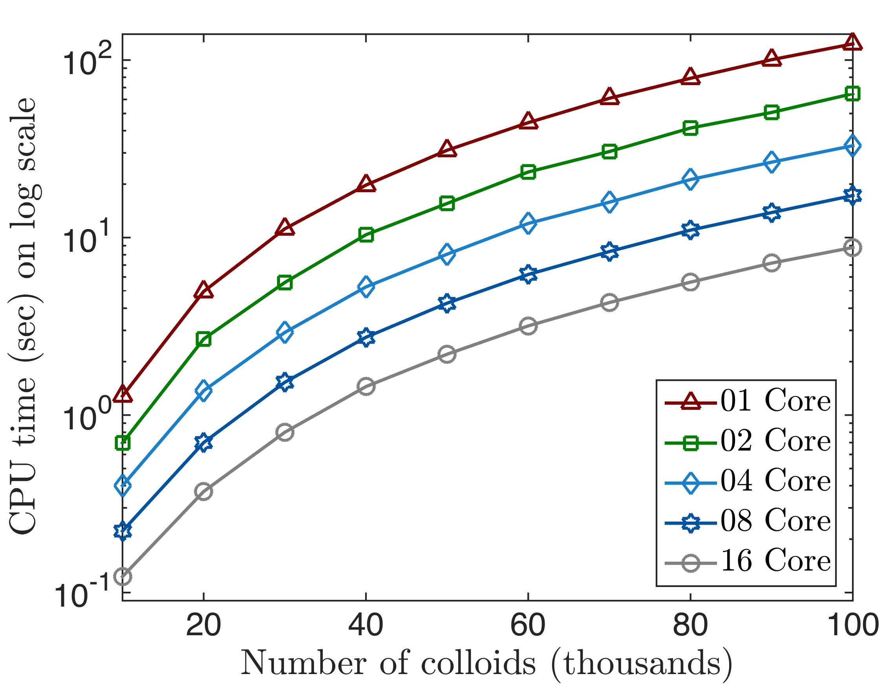

## PyStokes: Benchmark of PyStokes

The library scales linearly with the number of cores while an *O(M^2)* computational effort for *M* unknowns when matrix-vector products are computed directly as shown below. 

The above benchmark of PyStokes library is done on a 16-core machine for the evaluation of propulsion tensor corresponding to potential dipole.
